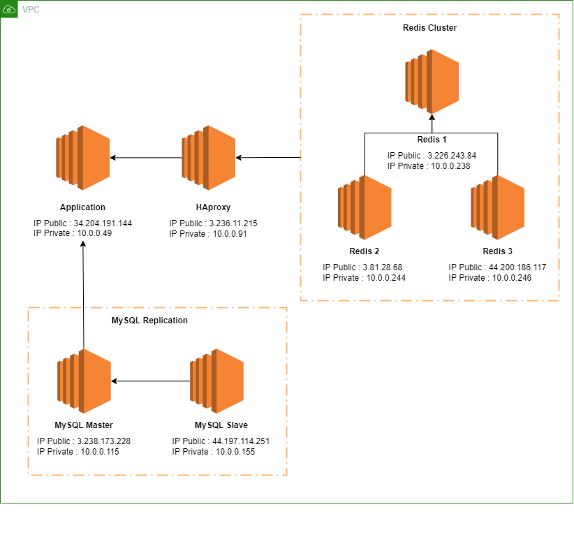

# Final Project BDT

## ARSITEKTUR

Berikut merupakan arsitektur pada server AWS

## SCRIPT

Berikut merupakan script untuk melakukan instalasi serta configurasi pada webserver, haproxy, mysql replication, serta redis cluster

- Web Server
    * [install.sh](https://github.com/hipzi/FP_BDT/blob/db6281073e49f020036d371980f9ddaa899d3048/script/webserver/install.sh)
    * [config.sh](https://github.com/hipzi/FP_BDT/blob/db6281073e49f020036d371980f9ddaa899d3048/script/webserver/config.sh)
    * [setup.sh](https://github.com/hipzi/FP_BDT/blob/db6281073e49f020036d371980f9ddaa899d3048/script/webserver/setup.sh)
    * [application](https://github.com/hipzi/FP_BDT/blob/db6281073e49f020036d371980f9ddaa899d3048/script/webserver/application)
- HAproxy
    * [install.sh](https://github.com/hipzi/FP_BDT/blob/db6281073e49f020036d371980f9ddaa899d3048/script/haproxy/install.sh)
    * [haproxy.cfg](https://github.com/hipzi/FP_BDT/blob/db6281073e49f020036d371980f9ddaa899d3048/script/haproxy/haproxy.cfg)
- MySQL Replication
    * [config.sh](https://github.com/hipzi/FP_BDT/blob/db6281073e49f020036d371980f9ddaa899d3048/script/mysql%20replication/config.sh)
    * [config-master-slave.sh](https://github.com/hipzi/FP_BDT/blob/db6281073e49f020036d371980f9ddaa899d3048/script/mysql%20replication/config-master-slave.sh)
    * [mysql-user-db.sh](https://github.com/hipzi/FP_BDT/blob/db6281073e49f020036d371980f9ddaa899d3048/script/mysql%20replication/mysql-user-db.sh)
    * [mysql-user.sh](https://github.com/hipzi/FP_BDT/blob/db6281073e49f020036d371980f9ddaa899d3048/script/mysql%20replication/mysql-user.sh)
    * [mysql-replication.sh](https://github.com/hipzi/FP_BDT/blob/db6281073e49f020036d371980f9ddaa899d3048/script/mysql%20replication/mysql-replication.sh)
- Redis Cluster
    * [install.sh](https://github.com/hipzi/FP_BDT/blob/db6281073e49f020036d371980f9ddaa899d3048/script/redis/install.sh)
    * [config.sh](https://github.com/hipzi/FP_BDT/blob/db6281073e49f020036d371980f9ddaa899d3048/script/redis/config.sh)
    * [redis.conf](https://github.com/hipzi/FP_BDT/blob/db6281073e49f020036d371980f9ddaa899d3048/script/redis/redis.conf)
    * [sentinel.conf](https://github.com/hipzi/FP_BDT/blob/db6281073e49f020036d371980f9ddaa899d3048/script/redis/sentinel.conf)
    * [sentinel.service](https://github.com/hipzi/FP_BDT/blob/db6281073e49f020036d371980f9ddaa899d3048/script/redis/sentinel.service)